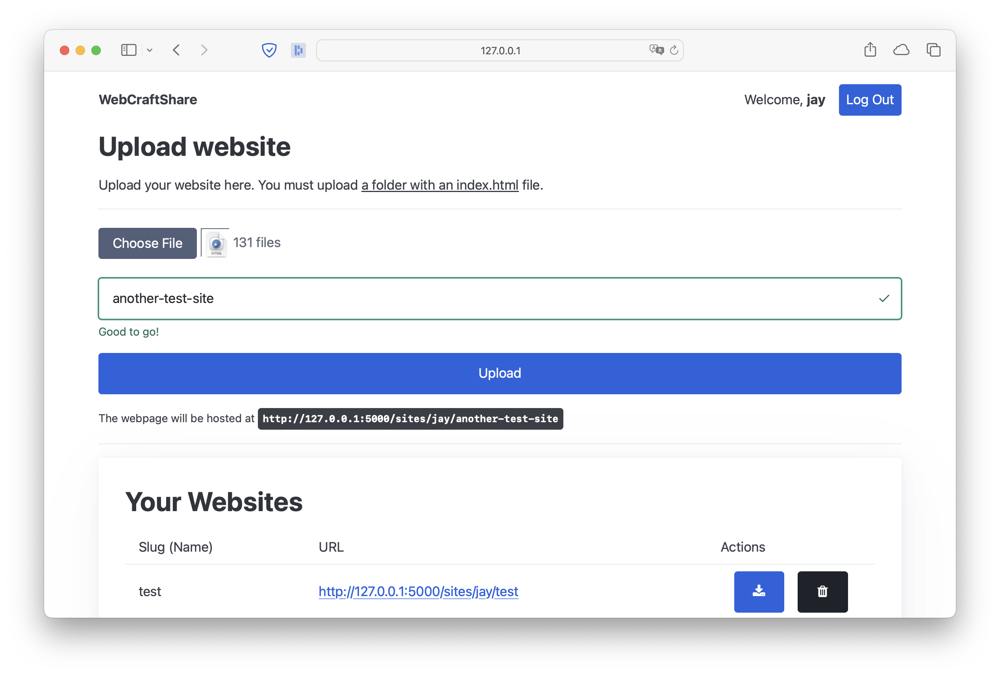

# WebCraftShare Documentation


This service allows pre-configured students to log in, upload their web project files (HTML, CSS, JS, etc.), and get a link that they can share.

## Table of Contents

- [File Structure](#file-structure)
- [Installation and Setup](#installation-and-setup)

## File Structure

```text
├── app.py # Flask application
├── add_user.py # Script to add a new user
├── auth.py # Authentication functions
├── common_passwords.txt # List of common passwords to check against
├── config.json # Configuration file
├── user.json # User data
├── requirements.txt # Python dependencies
│
├── media/ # Folder for all media files in readme
│
├── static/ # Static files such as JS, CSS, etc.
│ ├── css/ # CSS files (This use pico css)
│ ├── html/ # HTML files
│ ├── img/ # Images
│ ├── js/ # JS files (This use VUE js)
│
└── userdata/ # Folder for all user data
  ├── user1/ # Folder for a specific user
  │ ├── project1/ # A specific project of the user
  │ └── project2/
  ├── user2/
  ...
```

## Installation and Setup
1. Install [Python 3.9](https://www.python.org/downloads/)  or higher and pip.
2. Clone this repository. `git clone https://github.com/SuhJae/WebCraftShare.git`
3. Install dependencies. `pip install -r requirements.txt`
4. Edit config.json to your liking. **Make sure to change the secret key!**
    ```json
    {
      "secret_key": "SECRET_KEY",
      "security": {
        "enabled": true,
        "lockout-thresholds": {
          "5": 60,
          "8": 300,
          "10": 3600,
          "15": 86400,
          "20": -1
        }
      }
    }
    ```
   **WARNING: If you disable security, anyone can log in as any user without a password. This is made for development purposes only.**
5. Add a user by running `python add_user.py`. You will be prompted for a username and password. The password will be hashed and stored in `user.json`.
6. If you are going to use this service in production, make sure to set up a reverse proxy and HTTPS. You can use [Caddy](https://caddyserver.com/) for this.
7. Run the application. `python app.py`
8. You can now access the service at http://localhost:5000.